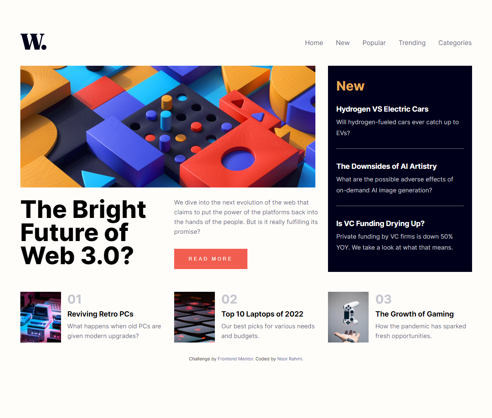

# Frontend Mentor - News homepage solution

This is a solution to the [News homepage challenge on Frontend Mentor](https://www.frontendmentor.io/challenges/news-homepage-H6SWTa1MFl). Frontend Mentor challenges help you improve your coding skills by building realistic projects.

## Table of contents

- [Overview](#overview)
  - [The challenge](#the-challenge)
  - [Screenshot](#screenshot)
  - [Links](#links)
- [My process](#my-process)
  - [Built with](#built-with)
  - [What I learned](#what-i-learned)
  - [Useful resources](#useful-resources)
- [Author](#author)

## Overview

### The challenge

Users should be able to:

- View the optimal layout for the interface depending on their device's screen size
- See hover and focus states for all interactive elements on the page

### Screenshot

### Links

- Solution URL: [github page](https://github.com/rahmi1016/news-hompage)
- Live Site URL: [live site](https://rahmi1016.github.io/news-hompage/)

## My process

### Built with

- Semantic HTML5 markup
- CSS custom properties
- Flexbox
- CSS Grid
- Javascript

### What I learned

Application of CSS Grid.

### Useful resources

- [How TO - Responsive Top Navigation](https://www.w3schools.com/howto/howto_js_topnav_responsive.asp)
- [CodePen Home Pure CSS Responsive Navbar](https://codepen.io/jo_Geek/pen/xgbaEr?editors=1100)
- [CSS selectors](https://developer.mozilla.org/en-US/docs/Web/CSS/CSS_Selectors)
- [How to Build a Responsive Navigation Bar With Flexbox](https://webdesign.tutsplus.com/tutorials/how-to-build-a-responsive-navigation-bar-with-flexbox--cms-33535)

## Author

- Frontend Mentor - [@rahmi1016](https://www.frontendmentor.io/profile/rahmi1016)
